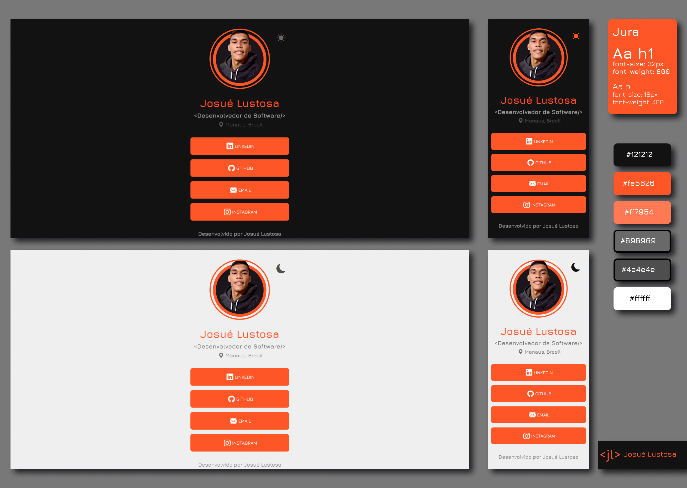

# Página de Links — Josué Lustosa

Página pessoal estática para centralizar contatos, redes profissionais,
currículo e informações sobre a trajetória de Josué Lustosa, Desenvolvedor de
Software.

**Versão V2 em desenvolvimento na branch `dev`.** A publicação estável permanece
disponível em [josuelustosa.github.io/links](https://josuelustosa.github.io/links/).



## Recursos

- Conteúdo de perfil, tecnologias e links centralizado em `data/site.json`.
- Tabs acessíveis para as áreas **Links** e **Sobre**.
- Tema claro/escuro, com preferência do sistema no primeiro acesso e persistência
  da escolha manual.
- Compartilhamento da URL canônica com feedback acessível.
- Links externos protegidos com `noopener noreferrer`.
- SVGs locais Phosphor e Devicons; fonte Jura local e carregada com
  `font-display: swap`.
- Layout responsivo para mobile, tablet e desktop.

## Stack

- HTML, CSS e JavaScript puros.
- JSON como fonte de conteúdo editável.
- GitHub Pages para hospedagem estática.

## Executar localmente

O projeto não requer instalação ou etapa de build.

```bash
python3 -m http.server 8080 --bind 127.0.0.1
```

Abra `http://127.0.0.1:8080` no navegador.

## Manutenção de conteúdo

Consulte o [guia de configuração dos links](./docs/configuracao-de-links.md)
antes de editar `data/site.json`.

## Qualidade

Auditoria local mais recente com Lighthouse:

| Categoria | Resultado |
| --- | ---: |
| Desempenho | 100 |
| Acessibilidade | 100 |
| Boas práticas | 100 |
| SEO | 100 |

Os resultados locais devem ser confirmados no ambiente de produção após a
publicação.

## Licenças e uso de assets

O código é disponibilizado sob a [licença MIT](./LICENSE.md). Consulte
[NOTICE.md](./NOTICE.md) para atribuições de fontes e ícones e para as
restrições de reutilização de foto, currículo, marca e dados pessoais.
