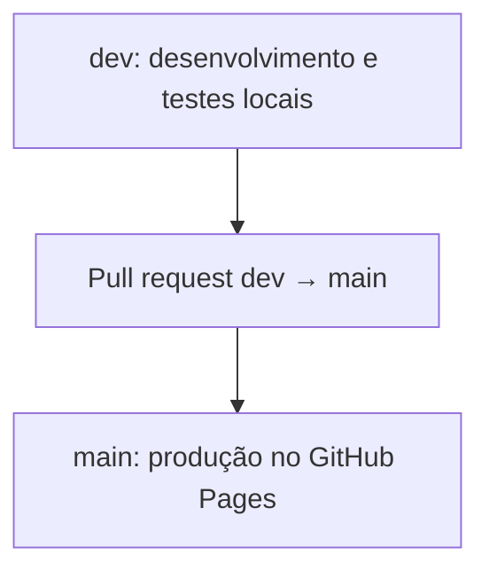

# Plano definitivo de implementação — V2

## 1. Objetivo e escopo

A V2 moderniza a Página de Links sem migrar a stack atual. O projeto continuará estático, com HTML, CSS, JavaScript e GitHub Pages.

A experiência seguirá uma única composição responsiva: mesma hierarquia em mobile, tablet e desktop, alterando apenas largura, espaçamentos e escala.

### Incluído na V2

- Novo layout visual aprovado.
- Perfil fixo: foto, nome, profissão e cidade.
- Ações de tema e copiar link flutuantes junto ao perfil.
- Tabs `Links` e `Sobre`.
- Links e textos configuráveis por JSON.
- Tema claro/escuro persistente.
- Compartilhamento por cópia da URL.
- Ícones SVG locais e consistentes, selecionados da família Phosphor Icons.
- Otimização de PageSpeed, acessibilidade e estabilidade visual.
- Atualização de documentação, licença e organização de milestones.

### Fora da V2

- QR Code.
- React, Next.js e Tailwind CSS.
- Painel administrativo, backend ou autenticação.
- Deploy de DEV, GitHub Actions adicionais ou segunda URL de preview.
- `CODE_OF_CONDUCT.md` e `CONTRIBUTING.md`.

## 2. Versão atual e controle de branches

A milestone `v1` está 100% concluída. Ela representa formalmente a versão atual do projeto.

| Elemento       | Definição                                     |
| -------------- | --------------------------------------------- |
| Milestone `v1` | Histórico funcional da V1; deve ser encerrada |
| Tag `v1.0.0`   | Referência técnica imutável do commit da V1   |
| `main`         | Código de produção e origem do GitHub Pages   |
| `dev`          | Desenvolvimento e validação da V2             |

### Etapa inicial obrigatória

1. Confirmar que `main` corresponde ao site em produção.
2. Criar a tag `v1.0.0`, se ainda não existir.
3. Fechar a milestone `v1`.
4. Criar a branch `dev` a partir de `main`.

```bash
git switch main
git pull --ff-only origin main
git status
git tag --list v1.0.0
```

Se a tag ainda não existir:

```bash
git tag -a v1.0.0 -m "Versão estável anterior à V2"
git push origin v1.0.0

git switch -c dev
git push -u origin dev
```

## 3. Fluxo de desenvolvimento e publicação



- Todo o trabalho da V2 acontece em `dev`.
- O site publicado não é alterado durante o desenvolvimento.
- Ao concluir e validar a V2, abrir PR de `dev` para `main`.
- O GitHub Pages continua publicando apenas a `main`.
- Não haverá ambiente de DEV hospedado agora.

Para testar localmente:

```bash
git switch dev
python3 -m http.server 8080
```

Acessar em `http://localhost:8080`. Isso será necessário porque o projeto buscará o JSON via `fetch()`.

A estrutura também deixa uma migração futura para Vercel naturalmente preparada: `main` poderá ser produção e `dev` poderá ser usada para previews, sem alterar o fluxo de branches.

## 4. Organização das milestones

### Milestone atual da V2

Renomear ou atualizar para:

```text
V2 — Interface, conteúdo e qualidade
```

Descrição:

> Nova versão da Página de Links, mantendo HTML, CSS e JavaScript, com interface responsiva, conteúdo configurável por JSON, tabs, tema persistente, cópia de link, otimizações de desempenho, acessibilidade e documentação.

Issues da V2:

1. Preservar V1 e criar branch `dev`.
2. Implementar interface responsiva da V2.
3. Adicionar conteúdo dinâmico por JSON.
4. Adicionar tabs, tema e cópia de link.
5. Otimizar desempenho, acessibilidade e SEO.
6. Atualizar documentação, licença e roadmap.

### Milestone futura

Criar:

```text
Futuro — Stack e colaboração
```

Mover para ela:

- #6 — Adicionar diretrizes de contribuição.
- #7 — Estabelecer um código de conduta.
- Upgrade para React + Next.js.
- Geração de QR Code.

## 5. Estrutura técnica da V2

```text
/
├── data/
│   └── site.json
├── assets/
│   ├── icons/
│   │   └── phosphor/
│   │       ├── manifest.json
│   │       ├── regular/
│   │       └── fill/
│   ├── img/
│   └── docs/
├── src/
│   ├── styles/
│   │   ├── index.css
│   │   ├── tokens.css
│   │   ├── base.css
│   │   ├── shell.css
│   │   ├── about.css
│   │   └── links.css
│   └── js/
│       ├── app.js
│       ├── links.js
│       ├── tabs.js
│       ├── theme.js
│       └── share.js
├── index.html
├── README.md
├── LICENSE
├── NOTICE.md
└── CHANGELOG.md
```

### Organização CSS

A V2 usará folhas de estilo por responsabilidade para impedir que o CSS cresça
em um único arquivo e para preservar a fronteira entre as tabs.

- `index.css`: ponto de entrada referenciado por `index.html`; importa os
  demais arquivos em ordem explícita. Não contém regras visuais.
- `tokens.css`: design tokens globais, temas e custom properties em `:root`.
- `base.css`: reset, elementos HTML, tipografia base, acessibilidade global e
  preferências de movimento reduzido.
- `shell.css`: composição compartilhada fora dos painéis — página, perfil,
  avatar, ações, feedback de compartilhamento, tabs, divisor e rodapé.
- `about.css`: bio, tecnologias e demais regras exclusivas da aba Sobre.
- `links.css`: lista de links, variantes de card, CTA e regras exclusivas da
  aba Links.

O `index.css` fixa a ordem de precedência pela ordem dos imports:

```css
@import url("./tokens.css");
@import url("./base.css");
@import url("./shell.css");
@import url("./about.css");
@import url("./links.css");
```

A refatoração deve ocorrer antes do refinamento visual da aba Links, em um
commit próprio (`refactor: split V2 styles by responsibility`). Ela move regras
sem alterar seletores, tokens, ordem visual ou comportamento. Cada módulo é
responsável pelos próprios breakpoints e estados de interação; regras globais
ou compartilhadas não devem ser adicionadas às folhas de uma tab.

Não devem ser usadas cascade layers nesta etapa: a separação é uma refatoração
semântica do CSS existente e a ordem normal da cascata preserva corretamente a
especificidade entre regras compartilhadas e regras de cada tab. O `base.css`
também preserva o comportamento nativo de qualquer elemento com `[hidden]`.

Como o projeto permanece sem etapa de build, a validação inclui verificar o
waterfall de CSS e o Lighthouse após a divisão. Se os imports apresentarem
impacto mensurável, a estratégia de carregamento deverá ser revista sem voltar
a concentrar regras de componentes em um único arquivo.

### Interface

- Coluna central com `width: min(100%, 390px)`; os `24px` de padding lateral
  preservam o conteúdo em `342px` no viewport de referência.
- Mesma ordem de conteúdo em qualquer breakpoint.
- Bloco de perfil sempre acima das tabs.
- Botões flutuantes ancorados ao contêiner do perfil, nunca à viewport.
- Tabs em controle segmentado:
  - ativo: preenchimento laranja;
  - inativo: superfície escura/clara discreta.

- Aba `Links`: e-mail, LinkedIn, GitHub, currículo e CTA comercial.
- Aba `Sobre`: bio curta, stacks e posicionamento profissional.

### Política de ícones — Phosphor Icons

A biblioteca de referência dos ícones da V2 será o [Phosphor Icons](https://phosphoricons.com/). A definição do padrão acontece agora, mas a seleção, o download e a substituição dos ícones ocorrerão **após as telas da interface serem concluídas e aprovadas**. Assim, o inventário refletirá os ícones, pesos e estados que o layout realmente exige, evitando baixar ou manter assets sem uso.

Padrão de obtenção e uso:

1. Levantar os ícones por tela e estado de interação antes de iniciar a migração.
2. Baixar somente os SVGs individuais necessários, a partir do site oficial ou dos assets brutos do pacote oficial `@phosphor-icons/core`, fixando a versão usada.
3. Salvar cada asset em `assets/icons/phosphor/<peso>/<nome>-<peso>.svg`, com nomes em `kebab-case`. Exemplo: `assets/icons/phosphor/regular/sun-regular.svg`.
4. Registrar em `assets/icons/phosphor/manifest.json` o nome, peso, versão de origem, URL de referência e locais de uso de cada ícone. Esse arquivo é apenas de manutenção; não será carregado pelo site.
5. Usar `regular` como peso padrão e `fill` apenas quando a tela aprovada indicar estado selecionado, ativo ou destaque. Outros pesos dependem de justificativa visual explícita.
6. Manter o `viewBox` original e controlar tamanho e cor pelo CSS do componente, usando `currentColor`. Não incluir CDN, webfont, pacote inteiro ou carregamento remoto em tempo de execução.
7. Para ícones decorativos ao lado de texto, usar `alt=""` e `aria-hidden="true"`; para ações sem texto, fornecer nome acessível no botão.
8. Remover os SVGs antigos quando não houver mais referências e registrar a atribuição MIT do Phosphor em `NOTICE.md`.

O trabalho entrará entre a aprovação das telas e a implementação da interface responsiva, em um commit próprio:

```text
chore: add local phosphor icons
```

## 6. Conteúdo dinâmico

Criar `data/site.json` para concentrar o conteúdo editável.

```json
{
  "profile": {
    "name": "Josué Lustosa",
    "role": "Desenvolvedor de Software",
    "location": "Manaus, Brasil",
    "bio": "Desenvolvedor de software focado em experiências digitais claras, acessíveis e bem construídas.",
    "stacks": ["React", "TypeScript", "React Native", "Front-end"]
  },
  "links": []
}
```

Cada link deverá possuir, no mínimo:

- `id`
- `title`
- `description`
- `href`
- `icon`
- `featured`
- `visible`

O HTML manterá somente os contêineres semânticos; o JavaScript buscará o JSON e renderizará os cards. O editor do GitHub será o meio simples de atualizar conteúdo.

## 7. Interações

### Tema

- Considerar a preferência do sistema no primeiro acesso.
- Persistir escolha manual em `localStorage`.
- Usar botão acessível com `aria-label`, foco visível e área adequada para toque.

### Tabs

- Implementar `tablist`, `tab` e `tabpanel`.
- Suportar teclado.
- Não duplicar o perfil dentro do conteúdo das tabs.

### Copiar link

- O botão de compartilhamento copia a URL canônica.
- Usar `navigator.clipboard`.
- Exibir feedback como “Link copiado”.
- Implementar fallback para navegadores sem Clipboard API.

## 8. PageSpeed, acessibilidade e SEO

Metas da V2:

| Métrica               |            Meta |
| --------------------- | --------------: |
| Desempenho            |            ≥ 95 |
| Acessibilidade        | ≥ 95; ideal 100 |
| Práticas recomendadas |             100 |
| SEO                   |             100 |
| Navegação agêntica    |             2/2 |

Ações previstas:

- Definir dimensões explícitas para imagens.
- Otimizar a foto de perfil se ela for identificada como elemento LCP.
- Usar imagem local otimizada em WebP como alternativa caso a imagem remota impacte o carregamento.
- Substituir fonte completa de ícones por SVGs locais/inline usados de fato.
- Aplicar a política de ícones do Phosphor: SVGs locais, individuais e com pesos limitados ao necessário.
- Limitar pesos de fontes e configurar `fontfont-display: swap`.
- Carregar scripts com `defer` ou módulos.
- Remover animações contínuas e tarefas desnecessárias.
- Corrigir contraste nos dois temas.
- Garantir foco visível, nomes acessíveis, textos alternativos e hierarquia de títulos.
- Revisar favicon, canonical, meta description, Open Graph e JSON-LD.

Validar com Lighthouse localmente e, depois da publicação em `main`, com PageSpeed Insights na URL de produção.

## 9. Documentação e licença

Atualizar:

- `README.md`: visão geral, preview, funcionalidades, stack, estrutura e execução local.
- `docs/configuracao-de-links.md`: campos e manutenção do JSON.
- `CHANGELOG.md`: lançamento da V2.
- `LICENSE`: MIT aplicável ao código.
- `NOTICE.md`: foto, currículo, marca e informações pessoais não são licenciados para reutilização.

Adicionar ao roadmap:

> Código de conduta e diretrizes de contribuição serão criados quando o projeto passar a aceitar contribuições externas de forma ativa.

## 10. Critérios de conclusão da V2

- Layout aprovado reproduzido em HTML/CSS/JS.
- Testes em 320px, 360px, 390px, 768px, 1024px e desktop amplo.
- Tabs, tema e cópia de link funcionando.
- Conteúdo alterável somente pelo JSON.
- CSS modularizado por tokens, base, shell e regras de cada tab, sem regressão
  visual ou funcional.
- V1 preservada por milestone fechada e tag.
- `dev` usada durante toda a implementação.
- `main` recebe apenas a versão validada.
- Metas de Lighthouse/PageSpeed atendidas.
- Documentação atualizada.
- Milestone V2 encerrada.
- Tag `v2.0.0` criada após a publicação final.

## Convenção e sequência de commits

- Cada commit deve ser simples e atômico, representando uma única intenção verificável.
- Usar o padrão Conventional Commits, com assunto em inglês, no imperativo e sem ponto final.
- O corpo do commit é opcional. Usar bullet points somente quando o mesmo commit atômico reunir várias alterações relevantes e distintas que precisem de contexto.
